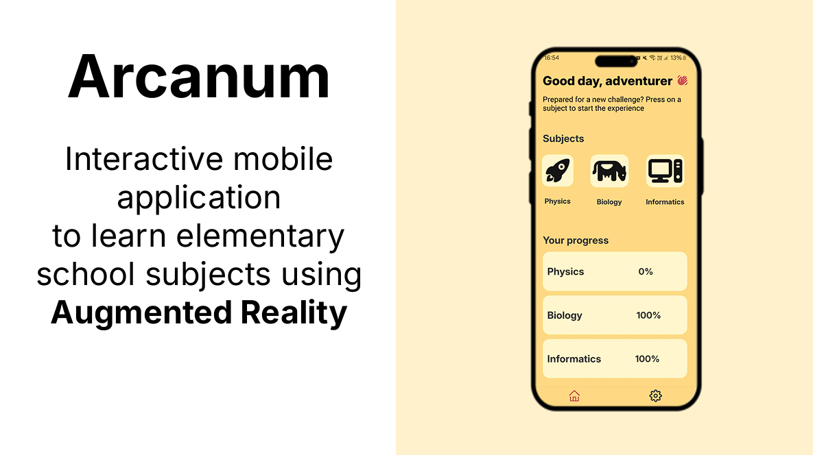
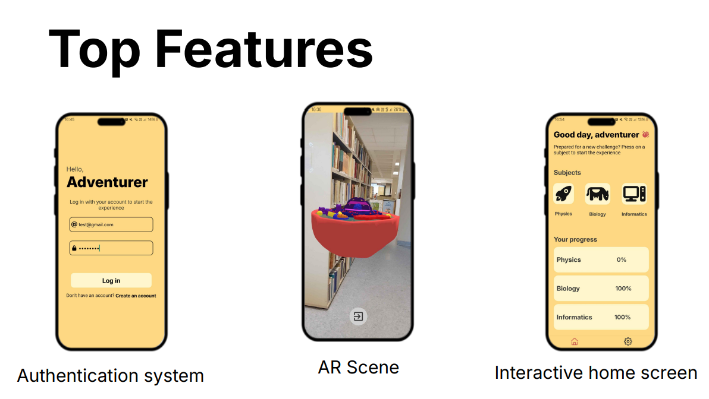

# Arcanum 




### Commands (in order) to create a basic, functional development build (personal notes):

```bash
# create app template
npx create-expo-app

# install dependencies
npx expo install expo-dev-client [install dependencies]

# create prebuild android folder
npx expo prebuild --clean -p android --no-install

# install AR support library
npm install --save @reactvision/react-viro

# modify/add dependencies for reactvision (very important)

# command for building on cloud (expo)
eas build --profile development --platform android

# command for building locally
eas build --platform android --local
```
